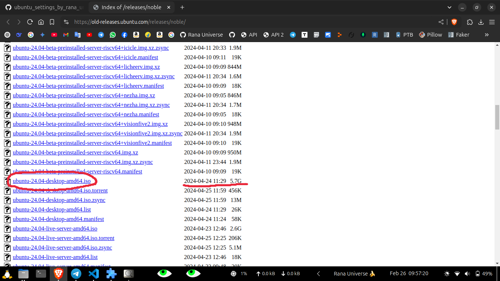

# Ubuntu Desktop Settings 🖥️


## This Project is for change the Desktop Interface and Settings for Ubuntu Linux Distributions. 🎨

[This Repository](./) is for the automation of my favourite customization to the interface of the Ubuntu os.

It will also help me to access my Favourite Shortcut Keys Combinations easily.

This is My Favourite Optimized & Minimal interface settings for Ubuntu for easy to use and easy to access .


## How to use this project? 🤔  


0. I am trying to make Releases of Different Versions of This Project. [Please Refer To This Section](./zzz_extra_need/releases_information.md) to know the informations about the releases and updates and so on.

1. Just After Install The Ubuntu os in a laptop/computer i need to use this repo to setup from beginning easily. And it works also offline.

1. Clone this repository or Find a appropriate Release to download.

1. Run `./installation_script.sh`  

1. Enjoy the Minimal, Optimized & Powerful Ubuntu experience! 🎉  


## Which Ubuntu Version This code Support? 🛠️

Currently, i am making this repository compatible with **Ubuntu 24.04 LTS**.  

| File Name | Release Date | Size |
|:-------------------------------|:-----------------|:-----|
| ubuntu-24.04-desktop-amd64.iso | 2024-04-24 11:29 | 5.7G |


### 🔍 How to Download OS? ⬇️

**See the reference below to locate the correct download link on the official website:**
<p align="center">
  
</p>


### 📥 Download Ubuntu 24.04 LTS  

We can choose to download this file from the following link:  
🔗 [Ubuntu 24.04 LTS Release Page](https://old-releases.ubuntu.com/releases/noble/)  

📌 **Direct ISO Download:**  
[ubuntu-24.04-desktop-amd64.iso](https://old-releases.ubuntu.com/releases/noble/ubuntu-24.04-desktop-amd64.iso)  

👉 **"Please contact me if the download link becomes unavailable in the future. I have stored a copy on my pendrive for easy sharing. 💿📂💻"**


## What Does The Code Do? 🤔

This project help me to setup Ubuntu os machine easily with the ```sudo apt install gnome-shell-extension-manager``` and then ```sudo apt install gnome-shell-extensions```. I mainly want one taskbar/panel in my desktop interface, so that i can easily navigate my mouse and use keyboard shortcut to access apps easily. It works like download the online extensions and then using the doncf file it will help to get back all the settings i changes in the extensions, settings, shortcuts and so on. Everything is there in the ```./installation_script.sh``` file which will do the work automtically.


## Sugesstion or Improvement ! 🚀

If you have any ideas to enhance the Ubuntu Desktop experience, [You Can Reach Me](https://github.com/RanaUniverse)!

**You can also contribute directly by 👇:**

Editing this repository manually by cloning or downloading a release.

Opening an issue on GitHub to suggest features or report bugs.

Contacting me if you find any issues that need fixing in future updates.

Your feedback and contributions are always welcome! 🎉